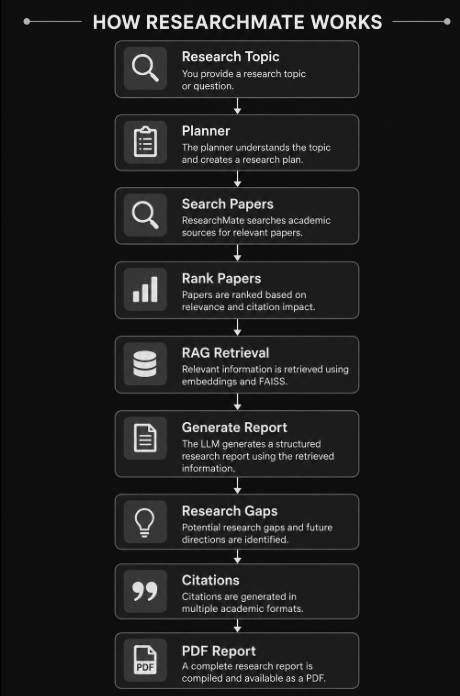
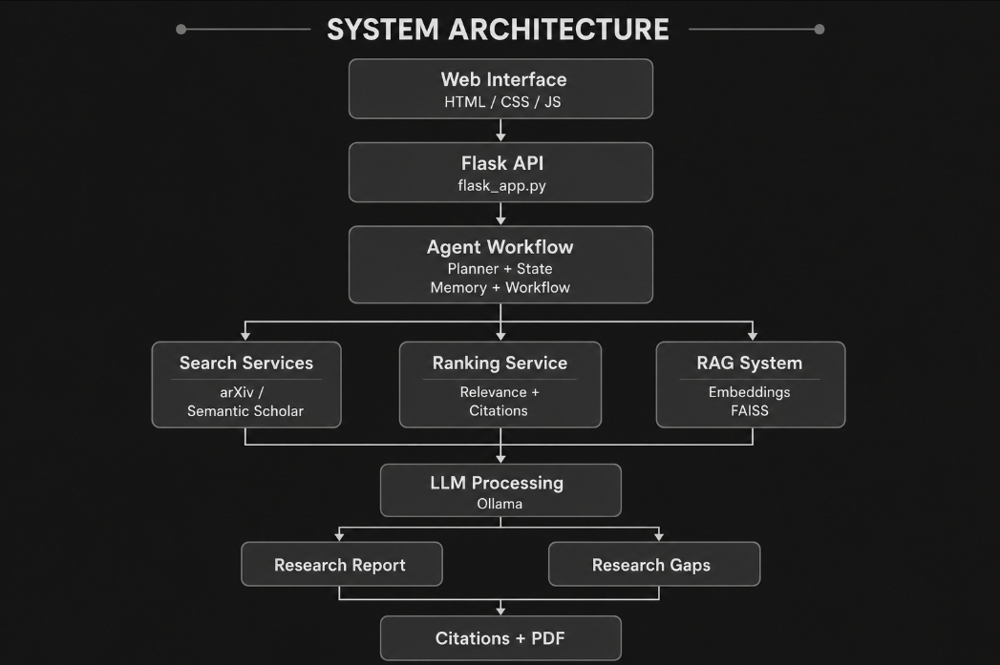
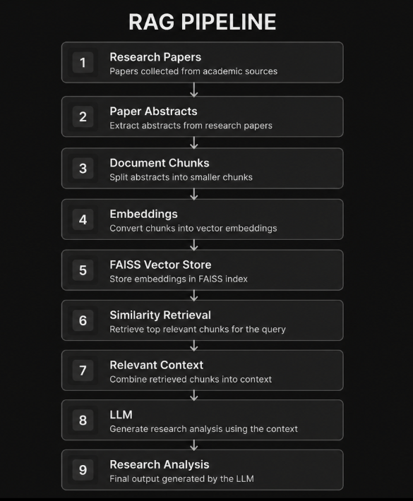
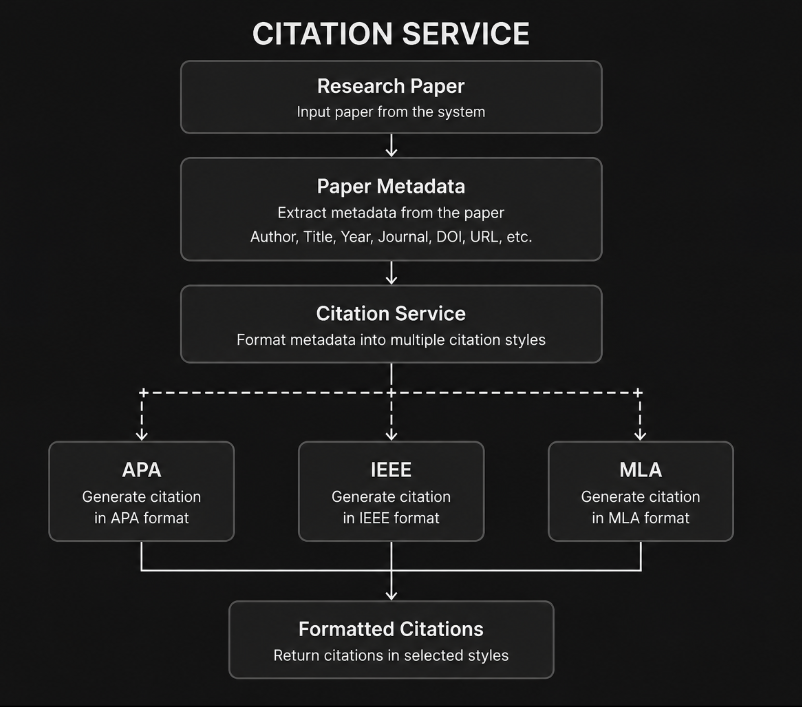
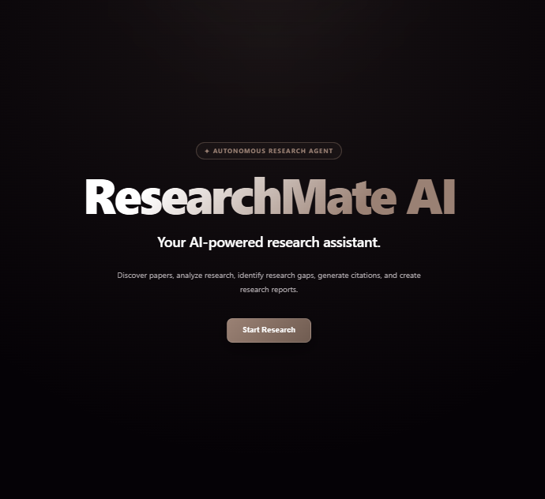
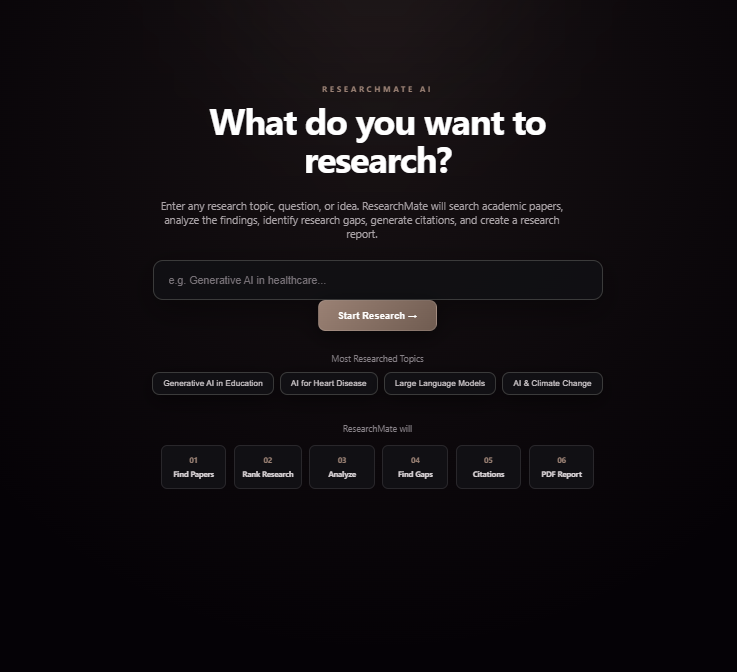
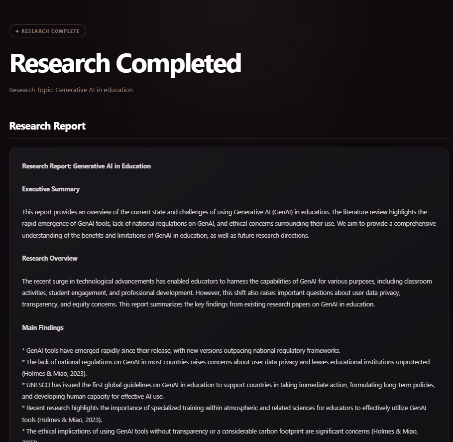
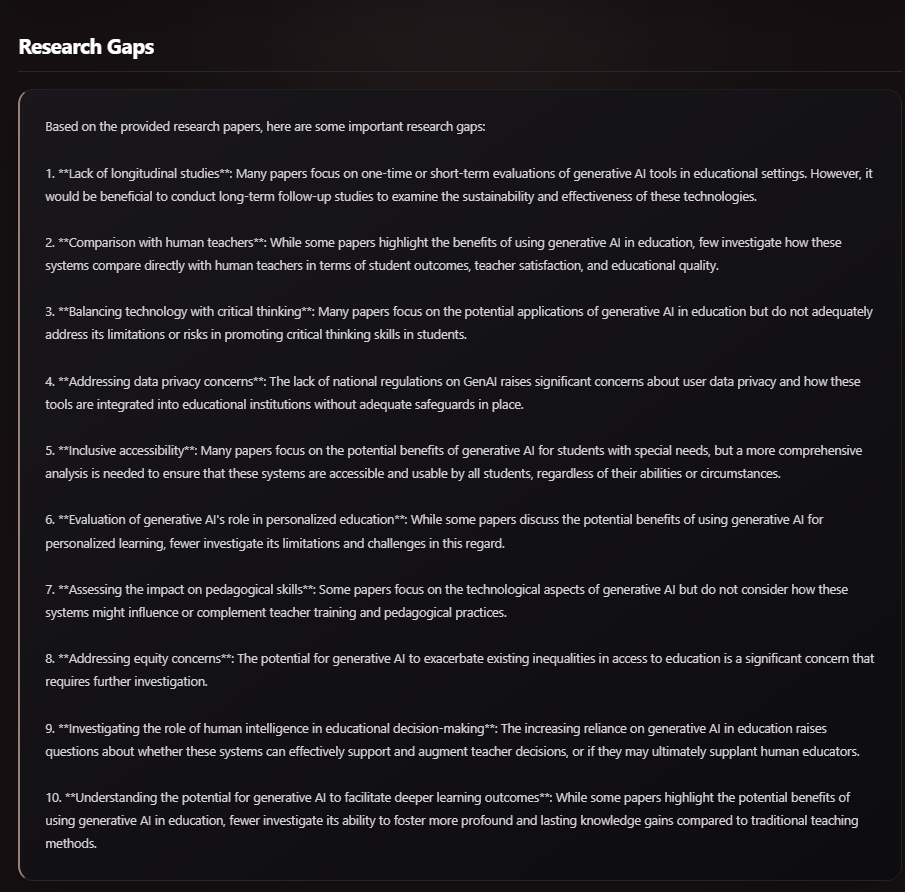
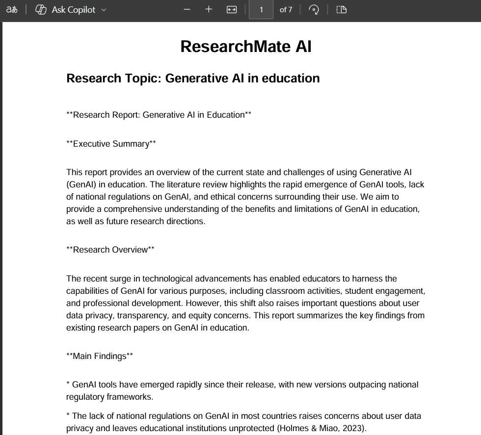

#  ResearchMate AI Agent

> An autonomous AI research assistant that discovers academic papers, ranks relevant research, retrieves relevant information using Retrieval-Augmented Generation (RAG), identifies potential research gaps, generates citations, and produces downloadable research reports.


---

## Table of Contents

* [Overview](#overview)
* [Purpose](#purpose)
* [Objective](#objective)
* [Key Features](#key-features)
* [How ResearchMate Works](#how-researchmate-works)
* [System Architecture](#system-architecture)
* [Research Workflow](#research-workflow)
* [RAG Pipeline](#rag-pipeline)
* [LLM Integration](#llm-integration)
* [Academic Sources](#academic-sources)
* [Paper Ranking](#paper-ranking)
* [Research Gap Identification](#research-gap-identification)
* [Citation Generation](#citation-generation)
* [PDF Report Generation](#pdf-report-generation)
* [Web Interface](#web-interface)
* [Screenshots](#screenshots)
* [Technology Stack](#technology-stack)
* [Project Structure](#project-structure)
* [Installation](#installation)
* [Running Locally](#running-locally)
* [Docker](#docker)
* [Environment Variables](#environment-variables)
* [Example Research Workflow](#example-research-workflow)
* [Project Goals](#project-goals)
* [Current Status](#current-status)
* [Limitations](#limitations)
* [Future Improvements](#future-improvements)
* [License](#license)
* [Author](#author)

---

## Overview

ResearchMate AI Agent is an AI-powered research assistant designed to automate and simplify the academic research workflow.

Instead of manually searching for papers, comparing research, retrieving relevant information, identifying research gaps, formatting citations, and preparing reports, ResearchMate coordinates these tasks through a structured research pipeline.


The project combines AI agent workflows, LLMs, RAG, vector search, academic APIs, ranking, citation generation, Flask, and Docker into a single research workflow.

---

## Purpose

Academic research often involves repetitive and time-consuming tasks such as:

* Finding relevant research papers
* Comparing different sources
* Extracting useful information
* Identifying important findings
* Discovering potential research gaps
* Formatting citations
* Organizing research into a structured report

ResearchMate was created to explore how an AI-powered system can coordinate these tasks into one automated workflow.

The project focuses on building a research assistant that goes beyond simple question answering by combining multiple research and AI components.

---

## Objective

The primary objective of ResearchMate is to build an AI research assistant capable of coordinating multiple research tasks.

The system is designed to:

1. Search academic sources.
2. Collect relevant research papers.
3. Rank papers using relevance and available citation information.
4. Store research information for retrieval.
5. Retrieve relevant context using RAG.
6. Generate research analysis using an LLM.
7. Identify potential research gaps.
8. Generate academic citations.
9. Produce a structured research report.
10. Generate a downloadable PDF.

---

## Key Features

| Feature                        | Description                                                |
| ------------------------------ | ---------------------------------------------------------- |
| Academic Search                | Searches research papers from integrated academic sources  |
| Paper Ranking                  | Ranks papers using relevance and citation information      |
| AI Research Analysis           | Uses an LLM to analyze collected research                  |
| Retrieval-Augmented Generation | Retrieves relevant research context before generation      |
| Research Gap Detection         | Identifies potential gaps and future research directions   |
| Report Generation              | Produces structured research reports                       |
| Citation Generation            | Generates APA, IEEE, and MLA citations                     |
| PDF Generation                 | Creates downloadable research reports                      |
| Web Interface                  | Provides a browser-based research interface                |
| Docker Support                 | Containerizes the application for reproducible execution   |
| Modular Architecture           | Separates agents, services, tools, RAG, and LLM components |

---





The workflow maintains the research state throughout the process.

---

## System Architecture







## LLM Integration

ResearchMate currently uses Ollama for local LLM inference during development and local Docker execution.

Current model:

```text
llama3.2:1b
```

The communication flow is:

```text
ResearchMate
      |
      v
HTTP Request
      |
      v
Ollama API
      |
      v
Llama 3.2:1b
      |
      v
Generated Response
```

This allows ResearchMate to use a locally running LLM without requiring the model itself to be packaged inside the application container.

### Production Deployment

Public deployment is not currently enabled.

The current Docker setup depends on Ollama running on the local host machine. A future production deployment will require cloud-accessible LLM infrastructure.

---

## Academic Sources

### arXiv

ResearchMate uses arXiv to discover academic research papers and retrieve research metadata.

### Semantic Scholar

ResearchMate also uses Semantic Scholar for academic search and metadata including:

* Title
* Authors
* Abstract
* Publication year
* Citation count
* Paper URL

The search service combines available results from the integrated academic sources.

---

## Paper Ranking

After collecting research papers, ResearchMate processes and ranks them using available research relevance and citation information.

The ranking logic is separated into:

```text
services/ranking_service.py
```

This modular design allows the ranking strategy to be improved independently from the search system.

---

## Research Gap Identification

ResearchMate analyzes collected research to identify potential areas that may require further investigation.

Potential outputs include:

* Underexplored research areas
* Limitations in existing work
* Missing perspectives
* Potential future research directions

Research-gap analysis is integrated into the overall research workflow.

---

## Citation Generation

ResearchMate generates citations for collected research papers.

Currently supported citation formats include:

* APA
* IEEE
* MLA
  



---

## PDF Report Generation

ResearchMate generates downloadable research reports using ReportLab.

A generated report can contain:

* Research topic
* Executive summary
* Research overview
* Main findings
* Paper comparison
* Research gaps
* Future research directions
* Conclusion
* References
* APA citations
* IEEE citations
* MLA citations

The generated PDF can be downloaded through the web interface.

---

## Web Interface

The Flask-powered interface allows users to:

1. Enter a research topic.
2. Start the research workflow.
3. Wait while ResearchMate processes the research.
4. View the generated report.
5. Review research gaps.
6. Review citations.
7. Download the generated PDF.

---

## Screenshots


### ResearchMate Interface




### Research 



### Generated Research Report



### Research Gaps





### Generated PDF


---

## Technology Stack

| Category             | Technology            |
| -------------------- | --------------------- |
| Programming Language | Python                |
| Backend              | Flask                 |
| LLM Runtime          | Ollama                |
| LLM                  | Llama 3.2 1B          |
| RAG                  | Custom RAG Pipeline   |
| Vector Search        | FAISS                 |
| Embeddings           | Hugging Face Hub      |
| Academic Search      | arXiv                 |
| Academic Search      | Semantic Scholar      |
| PDF Generation       | ReportLab             |
| Frontend             | HTML, CSS, JavaScript |
| Containerization     | Docker                |
| Version Control      | Git and GitHub        |

---

## Project Structure

```text
ResearchMate-AI-Agent/
|
├── agent/
│   ├── __init__.py
│   ├── memory.py
│   ├── planner.py
│   ├── prompts.py
│   ├── reasoning.py
│   ├── state.py
│   └── workflow.py
|
├── assets/
│   └── styles.css
|
├── frontend/
│   ├── __init__.py
│   └── index.html
|
├── llm/
│   ├── __init__.py
│   ├── huggingface.py
│   └── ollama.py
|
├── models/
│   ├── citation.py
│   ├── paper.py
│   └── report.py
|
├── rag/
│   ├── __init__.py
│   ├── chunking.py
│   ├── embeddings.py
│   ├── retriever.py
│   └── vector_store.py
|
├── services/
│   ├── citation_service.py
│   ├── gap_service.py
│   ├── pdf_service.py
│   ├── ranking_service.py
│   ├── report_service.py
│   ├── search_service.py
│   └── summary_service.py
|
├── tools/
│   ├── __init__.py
│   ├── arxiv_tool.py
│   └── semantic_scholar_tool.py
|
├── app.py
├── flask_app.py
├── requirements.txt
├── Dockerfile
├── .gitignore
└── README.md
```

---

## Installation

Clone the repository:

```bash
git clone <repository-url>
```

Move into the project directory:

```bash
cd ResearchMate-AI-Agent
```

Create a virtual environment:

```bash
python -m venv venv
```

Activate the virtual environment on Windows:

```powershell
venv\Scripts\Activate.ps1
```

Install the required dependencies:

```powershell
pip install -r requirements.txt
```

---

## Running Locally

Make sure Ollama is installed and running.

Check the Ollama installation:

```powershell
ollama --version
```

Check whether the Ollama server is running:

```powershell
curl http://localhost:11434
```

Check available models:

```powershell
ollama list
```

Make sure the required model is available:

```text
llama3.2:1b
```

Start ResearchMate:

```powershell
python flask_app.py
```

Open the application in your browser:

```text
http://127.0.0.1:5000
```

---

## Docker

ResearchMate has been successfully Dockerized and tested locally.

### Build the Docker Image

```powershell
docker build -t researchmate-ai .
```

This creates the Docker image:

```text
researchmate-ai:latest
```

### Run the Docker Container

```powershell
docker run -p 5000:5000 researchmate-ai
```

The port mapping:

```text
5000:5000
```

maps port `5000` inside the Docker container to port `5000` on the host machine.

The application can then be accessed at:

```text
http://localhost:5000
```

### Local Docker Architecture

```text
Windows Host
|
+-- Docker
|     |
|     +-- ResearchMate Container
|             |
|             +-- Flask Application
|
+-- Ollama
      |
      +-- Llama 3.2:1b
```

The Dockerized ResearchMate application communicates with the locally running Ollama service through the Docker host.

---

## Project Goals

ResearchMate was developed as a practical exploration of how AI systems can coordinate multiple tools and services to accomplish a larger research task.

The project focuses on implementing and understanding:

* AI agent workflows
* Agent planning
* State management
* Memory
* LLM integration
* Retrieval-Augmented Generation
* Embeddings
* Vector search
* Academic APIs
* Information retrieval
* Paper ranking
* Research analysis
* Research-gap detection
* Citation generation
* Report generation
* PDF generation
* Flask APIs
* Docker


---

## Limitations

- Research generation can take several minutes depending on the number of papers and LLM processing time.
- The current Docker setup relies on Ollama running on the host machine.
- The current deployment is intended for local development and demonstration.
- Research results depend on the availability, response time, and limits of external academic APIs.
- Public deployment requires a cloud-based LLM hosting solution.

---

## Future Improvements


- Cloud-based LLM deployment
- Public production deployment
- Additional academic sources such as PubMed
- Improved paper-ranking methods
- More advanced document-level RAG
- Persistent research memory
- Streaming research progress
- Faster research generation
- Improved research-gap analysis
- More advanced autonomous planning


##  Developer

**Summiya Yousaf**

Bachelor of Science in Artificial Intelligence

Air University Islamabad


### 🔗 Connect with me

- GitHub: https://github.com/summiyahyousaf
- LinkedIn: https://www.linkedin.com/in/summiya-yousaf-24411534a/
  
 ##  License

This project is licensed under the MIT License.


⭐ If you found this project interesting, consider giving it a star!

